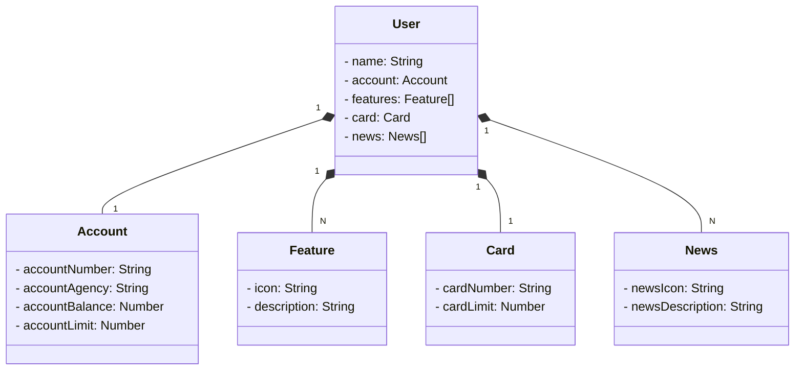

# Bank Application
## Java RESTful API Bank Application
A API Bank Application é uma aplicação Java baseada no framework Spring Boot.
Desenvolvida para simular as operações básicas de um aplicativo bancário, a API oferece endpoints RESTful para interações relacionadas a usuários, contas bancárias, cartões, recursos e notícias.
## Recursos Principais
### Cadastro e Atualização de Usuário
Endpoint para registrar novos usuários e atualizar informações existentes.
### Gestão de Contas Bancárias
Endpoint para visualizar informações da conta, como saldo e limite.
### Emissão de Cartões
Endpoint para solicitar e receber cartões de crédito associados às contas dos usuários.
### Associação de Recursos e Notícias
Endpoints para associar recursos e receber notícias relevantes para os usuários.
### Principais Entidades
User (Usuário): Representa um cliente do banco.  
Account (Conta Bancária): Descreve uma conta bancária vinculada a um usuário.  
Card (Cartão): Representa um cartão associado a um usuário.  
Feature (Recurso): Descreve um recurso disponível para o usuário.  
News (Notícia): Representa uma notícia relevante para o usuário.  
## Tecnologias Utilizadas
Linguagem de Programação: Java 17.  
Framework: Spring Boot 3.  
Persistência de Dados: Spring Data JPA.  
Banco de Dados: PostgreSQL.  
Documentação: Utiliza OpenAPI (Swagger) para documentação automática dos endpoints.
# Diagrama de Classes 

