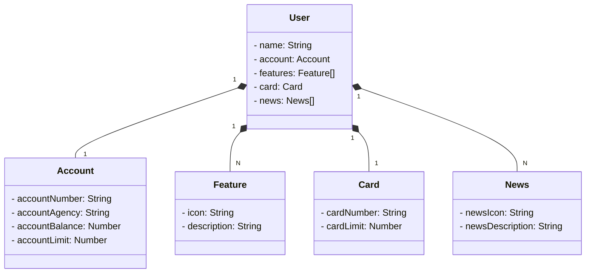

# Bank Application
## Java RESTful API Bank Application
A API Bank Application é uma aplicação Java baseada no framework Spring Boot.
Desenvolvida para simular as operações básicas de um aplicativo bancário, a API oferece endpoints RESTful para interações relacionadas a usuários, contas bancárias, cartões, recursos e notícias.
## Recursos Principais
### Recuperar Todos os Usuários

Endpoint: GET /users   
Recupera uma lista de todos os usuários registrados.  
### Respostas
Código 200: Operação bem-sucedida.  
### Recuperar Usuário por ID

Endpoint: GET /users/{id}   
Recupera informações específicas de um usuário com base no ID fornecido.  
### Respostas
Código 200: Operação bem-sucedida.  
Código 404: Usuário não encontrado.  
### Criar Novo Usuário

Endpoint: POST /users  
Cria um novo usuário com base nos dados fornecidos e retorna os dados do usuário recém-criado.  
### Respostas
Código 201: Usuário criado com sucesso.  
Código 422: Dados de usuário inválidos fornecidos.  
### Atualizar Usuário

Endpoint: PUT /users/{id}  
Atualiza os dados de um usuário existente com base no ID fornecido e retorna os dados atualizados.  
### Respostas
Código 200: Usuário atualizado com sucesso.  
Código 404: Usuário não encontrado.  
Código 422: Dados de usuário inválidos fornecidos.  
### Excluir Usuário

Endpoint: DELETE /users/{id}    
Exclui um usuário existente com base no ID fornecido.  
### Respostas
Código 204: Usuário excluído com sucesso.   
Código 404: Usuário não encontrado.   
### Principais Entidades
User (Usuário): Representa um cliente do banco.  
Account (Conta Bancária): Descreve uma conta bancária vinculada a um usuário.  
Card (Cartão): Representa um cartão associado a um usuário.  
Feature (Recurso): Descreve um recurso disponível para o usuário.  
News (Notícia): Representa uma notícia relevante para o usuário.  
## Tecnologias Utilizadas
Linguagem de Programação: Java 17.  
Framework: Spring Boot 3.  
Persistência de Dados: Spring Data JPA.  
Banco de Dados: PostgreSQL.  
Documentação: Utiliza OpenAPI (Swagger) para documentação automática dos endpoints.
# Diagrama de Classes 

